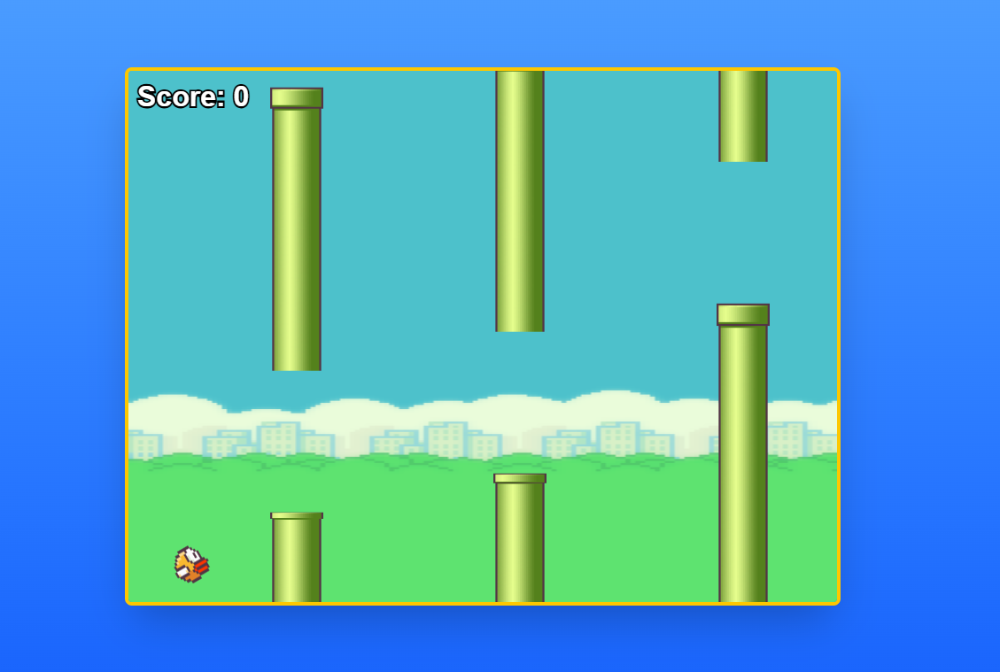

# 🐦 Flappy Bird Clone

A modern implementation of the classic Flappy Bird game built with Next.js and TypeScript. This project was developed using [Cursor](https://cursor.sh/), the AI-first code editor.



## 🎮 Features

- Modern, responsive design
- Smooth animations and physics
- Score tracking
- Sound effects
- Mobile-friendly controls

## 🛠️ Tech Stack

- [Next.js](https://nextjs.org/) - React framework
- TypeScript - Type safety
- Tailwind CSS - Styling
- HTML5 Canvas - Game rendering

## 🚀 Getting Started

1. Clone the repository:
```bash
git clone https://github.com/Rizvi-Faiz/Flappy_Bird.git
cd Flappy_Bird
```

2. Install dependencies:
```bash
npm install
# or
yarn install
```

3. Run the development server:
```bash
npm run dev
# or
yarn dev
```

4. Open [http://localhost:3000](http://localhost:3000) in your browser to play!

## 🎯 How to Play

- Press SPACE or click/tap to make the bird flap
- Avoid hitting the pipes
- Try to get the highest score possible!

## 📝 Development Notes

This game was developed using Cursor, leveraging its AI capabilities for enhanced development workflow and code quality. The implementation focuses on smooth gameplay and modern web technologies.

## 🤝 Contributing

Contributions are welcome! Feel free to open issues or submit pull requests.

## 📜 License

This project is open source and available under the MIT License.

---
Made with ❤️ using [Cursor](https://cursor.sh/)
